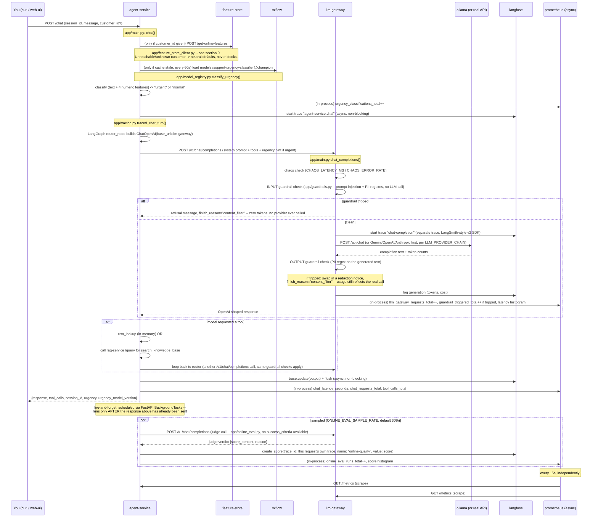
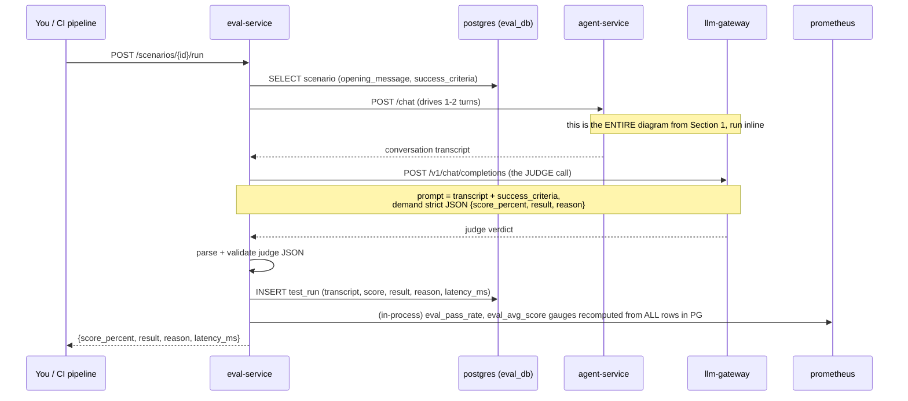
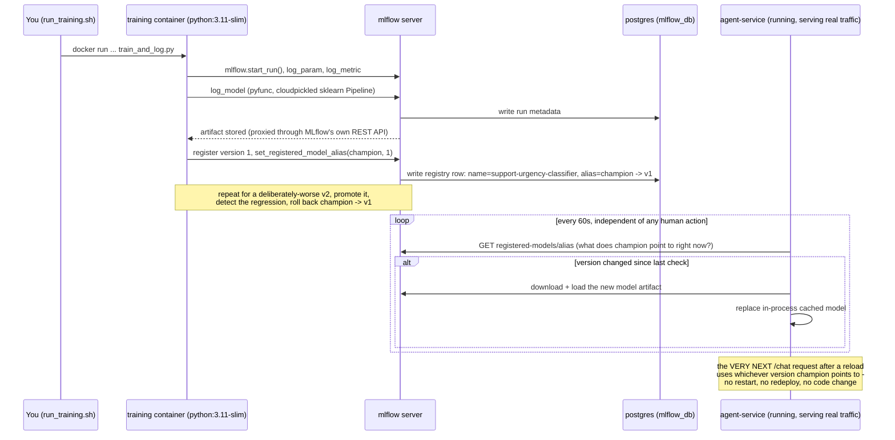
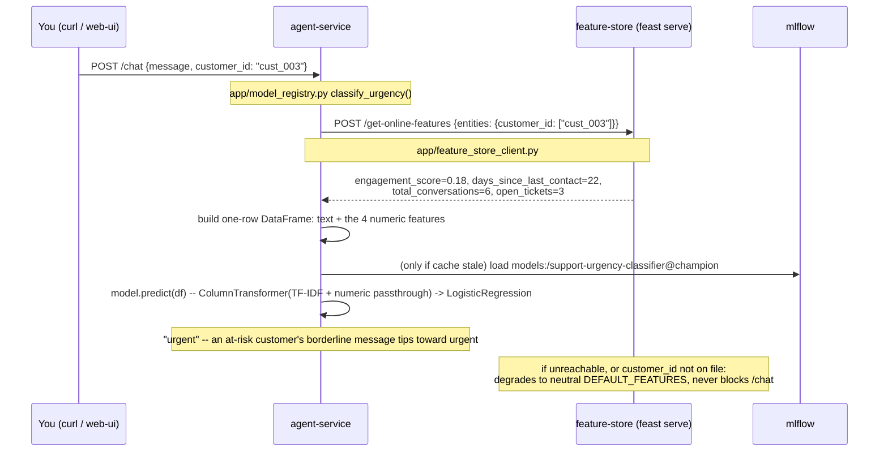

# Hands-on AI/ML/LLM Ops project — run it on localhost

A runnable local stack that mirrors the shape of a real production conversational-AI system, so you can practice the concepts in [`docs/concepts/`](docs/concepts/) against real, working code instead of reading about them.

Ten services, seven of them built from scratch for this project, three of them real open-source infra (Langfuse, MLflow, Prometheus+Grafana) wired in exactly like a real org would. It runs fully offline and free by default (a small local model via Ollama); flip one env var to point it at a real OpenAI/Anthropic key instead.

### Contents

- [Architecture](#architecture)
- [How it all works](#how-it-all-works)
- [What mirrors what](#what-mirrors-what)
- [Quick start](#quick-start)
- [Persistence](#persistence--what-survives-a-restart-what-doesnt)
- [Sharing this with your team](#sharing-this-with-your-team)
- [Port map](#port-map)
- [Exercises](#exercises-mapped-to-the-concepts-you-asked-about)
- [Verified: a real end-to-end run](#verified-a-real-end-to-end-run)
- [Known limitations](#known-limitations--honesty-notes)
- [Tearing down](#tearing-down)

## Architecture

This is the local system's own topology — every box below is something actually running on your machine right now via `docker compose up`.

```mermaid
flowchart TB
    subgraph Client["Client layer"]
        Browser["Your browser"]
        Locust["Locust (load-testing/)\nexternal, not in compose"]
        CI["CI pipeline (.github/workflows/)\nexternal, not in compose"]
        MCPInspector["MCP Inspector\nexternal, not in compose"]
    end

    WebUI["web-ui : 8090\nnginx, static JS\nChat / KB / Evals / Chaos tabs"]

    subgraph Core["Core AI services"]
        Gateway["llm-gateway : 8001\nFastAPI\nprovider fallback, chaos, inline guardrails, tracing"]
        Ollama["ollama : 11434\nlocal model runtime"]
        Rag["rag-service : 8002\nFastAPI + embedded Chroma\nnaive / hybrid retrieval"]
        Agent["agent-service : 8003\nFastAPI + LangGraph\n/chat, MCP server at /mcp\nsampled online-eval judging"]
        Eval["eval-service : 8004\nFastAPI\nLLM-as-judge scenarios (offline)"]
    end

    subgraph SharedData["Shared data"]
        Postgres["postgres : 5432\neval_db + mlflow_db"]
        ChromaVol[("rag_chroma_data volume")]
    end

    subgraph MLOps["MLOps"]
        MLflow["mlflow : 5050\ntracking + model registry\n(--workers 1)"]
        MLflowArtifacts[("mlflow_artifacts volume")]
        FeatureStore["feature-store : 6566\nfeast serve -- live online feature store,\nreal input to the urgency classifier"]
    end

    subgraph Tracing["LLM tracing (Langfuse v3) - part of the default stack"]
        LangfuseWeb["langfuse-web : 3000"]
        LangfuseWorker["langfuse-worker : 3030"]
        LangfuseDB["langfuse-db (postgres)"]
        LangfuseCH["langfuse-clickhouse : 8123/9000"]
        LangfuseRedis["langfuse-redis : 6380"]
        LangfuseMinio["langfuse-minio : 9190/9191\n+ langfuse-minio-init - one-shot bucket setup"]
    end

    subgraph Metrics["Metrics"]
        Prometheus["prometheus : 9090"]
        Grafana["grafana : 3001\nAI Ops Overview dashboard"]
    end

    Browser -->|opens| WebUI
    WebUI -->|"direct CORS calls"| Gateway
    WebUI -->|"direct CORS calls"| Rag
    WebUI -->|"direct CORS calls"| Agent
    WebUI -->|"direct CORS calls"| Eval

    Agent -->|"/v1/chat/completions"| Gateway
    Agent -->|"search_knowledge_base tool"| Rag
    Agent -->|"loads @champion urgency classifier, live"| MLflow
    Agent -->|"live customer features, feeds the classifier"| FeatureStore
    Agent -.->|"MCP protocol, tools exposed at /mcp"| MCPInspector

    Eval -->|"drives conversation via /chat"| Agent
    Eval -->|"judge call"| Gateway
    Eval -->|"scenarios, test_runs"| Postgres

    Gateway -->|"ollama - last in the default chain"| Ollama
    ExternalAPI["Gemini / OpenAI / Anthropic\n(real API, tried first by default)"]
    Gateway -.->|"LLM_PROVIDER_CHAIN, tried in order until one succeeds"| ExternalAPI

    Rag --> ChromaVol

    MLflow --> Postgres
    MLflow --> MLflowArtifacts

    Gateway -.->|"traces (optional)"| LangfuseWeb
    Agent -.->|"traces (optional)"| LangfuseWeb
    LangfuseWeb --> LangfuseDB
    LangfuseWeb --> LangfuseCH
    LangfuseWeb --> LangfuseRedis
    LangfuseWeb --> LangfuseMinio
    LangfuseWorker --> LangfuseDB
    LangfuseWorker --> LangfuseCH
    LangfuseWorker --> LangfuseRedis
    LangfuseWorker --> LangfuseMinio

    Prometheus -->|scrapes /metrics every 15s| Gateway
    Prometheus -->|scrapes /metrics every 15s| Rag
    Prometheus -->|scrapes /metrics every 15s| Agent
    Prometheus -->|scrapes /metrics every 15s| Eval
    Grafana -->|PromQL queries| Prometheus

    Locust -.->|load test| Agent
    Locust -.->|load test| Gateway
    CI -.->|"POST /scenarios/run-all, GET /metrics"| Eval
```



`agent-service` is the hub: it's the only service that calls `llm-gateway` (every LLM call), `rag-service` (knowledge-base search, exposed as a tool), and `feature-store` + `mlflow` (to classify each message's urgency with a live-loaded, versioned model). `llm-gateway` is the only thing that ever talks to an actual LLM provider. Tracing and metrics are pure observers — nothing in the request path depends on them being up.

**Verified resource footprint** — numbers from actually running this stack and measuring it (`docker stats`), not estimates:

| Configuration | Containers | Memory |
|---|---|---|
| Without Langfuse | 11 | ~1.4GB idle |
| Default (`docker compose up -d`, Langfuse included) | 17 | ~3.6GB under active load (chat + eval traffic) — re-verified stable across two cold starts and a deliberate stress test, ~1.25GB headroom remaining in a 4.8GB Docker VM |

`feature-store` (Feast's `feast serve`) is a genuinely light service, ~115MB resident (measured), well under `rag-service` or `mlflow`. Three real bugs were found and fixed via this measurement, not guessed at: `mlflow` was idling at ~1.6GB (a background async-job subsystem it doesn't need here — now disabled), `rag-service`'s image was 5.83GB from an accidentally-GPU `torch` build with no GPU to ever use it (now 1.81GB, CPU-only wheel pinned explicitly), and Langfuse's own stack caused real cascading failures under memory pressure before those two fixes existed (moved to an opt-in profile temporarily, then re-verified stable and moved back once the freed headroom held up under stress-testing — see "Verified" below for the full history).

**What maps to which Ops discipline:**

| Discipline | Which pieces | What you'd look at |
|---|---|---|
| **LLMOps** | `llm-gateway`, `agent-service`, Langfuse | Provider fallback behavior, prompt/tool-call traces, chaos injection, token usage, inline guardrails (`llm-gateway`), sampled online-eval judging (`agent-service`) |
| **MLOps** | `mlflow`, `feature-store` | Experiment tracking, model registry/aliasing (baseline/rollback), and — live, not just a demo — the urgency classifier combining message text with `feature-store`'s online customer features |
| **AIOps** (here: ops-for-the-AI-system, i.e. classic ops applied to this AI stack — see `docs/concepts/02-llmops-mlops-tooling.md` §1 for why that's a different thing from "AI-for-ops") | `prometheus`, `grafana`, `eval-service` + `ci-cd/` | Latency/error-rate dashboards, eval-gated deploys, incident runbooks (`docs/operations/sre-practices.md`) |

## How it all works

The diagram above shows the *static* map (which boxes exist, which arrows connect them). This section is the *dynamic* story: when a request enters the system, exactly what happens, in what order, touching which piece, until a response comes back out. It'll click faster after you've run something once — see the [Exercises](#exercises-mapped-to-the-concepts-you-asked-about) section below.

### The one-paragraph mental model

Everything in this project is one of four kinds of thing:
1. **A request handler** (`llm-gateway`, `rag-service`, `agent-service`, `eval-service`, `feature-store`) — a FastAPI (or Feast's own `feast serve`, same shape) service that does one job and calls its neighbors over plain HTTP.
2. **A brain** (Ollama, or a real OpenAI/Anthropic API) — the thing that actually generates text. Nothing else in the project talks to it directly except `llm-gateway`.
3. **A record-keeper** (Postgres, MLflow, Langfuse, Prometheus) — things that don't participate in answering a request, they just *observe* and *store* what happened, asynchronously, so you can look back later.
4. **A window** (Grafana, the web UI, MLflow's UI, Langfuse's UI) — things a human looks at. They never sit in a request's critical path.

Keep that split in your head — "does this thing help ANSWER the request, or does it just WATCH the request happen?" — and every diagram below will make sense immediately.

### 1. Trace a `/chat` request end to end (the LLMOps flow)



**Read this literally, top to bottom, and you have the whole LLMOps loop.** The things that make this "Ops" and not just "an API call":
- **Every hop is traced** (Langfuse) — if the final answer is wrong, you open the trace and see exactly which of the 2-4 LLM calls in that chain produced the bad output, not just "the response was bad."
- **Every hop is measured** (Prometheus, in-process counters/histograms, scraped later) — you can ask "has latency degraded over the last hour" as a question about *trends*, which no single trace can answer by itself.
- **Every request is guarded, inline** — the one check that's cheap enough to run on 100% of traffic without doubling cost/latency, because it's regex/keyword matching, not another LLM call.
- **A sample of real traffic is graded after the fact** — the online-eval judge call happens strictly after the user already has their answer, so a slow or failed judge call is invisible to them by construction.

Notice `mlflow` shows up early — that's **not a separate flow**, it's the *same* request occasionally pausing to refresh a cached ML model. That's the seam between LLMOps (everything else in this diagram) and MLOps (section 4 below) — they're not two different systems, one request path touches both.

### 2. Trace an eval run (the AIOps flow — grading the LLMOps flow from outside)



**Why this is the "AIOps" layer and not just more LLMOps:** this flow doesn't produce a customer-facing answer — it produces a *judgment about the quality* of the other flow, on a schedule/on-demand, and turns that judgment into a number (`eval_pass_rate`) that a dashboard or a CI pipeline can act on. That's the actual definition of AIOps used in this project: **using metrics/automation to operate the AI system itself**, as opposed to LLMOps (operating the LLM-calling code) or MLOps (operating the trained-model lifecycle). See `docs/concepts/02-llmops-mlops-tooling.md` §1 for the fuller three-way definition.

The eval-gate scripts in `.github/workflows/` and `ci-cd/` are this exact same flow, just triggered by a pipeline instead of a curl command, with a `if eval_pass_rate < threshold: fail the build` step bolted on the end.

### 3. Three genuinely different things the industry calls "evaluating an LLM system"

This project demonstrates all three side by side, on purpose, because they get conflated constantly and they're not interchangeable:

| | **Offline / scenario eval** (Section 2) | **Online / production eval** (Section 1) | **Guardrails** (Section 1) |
|---|---|---|---|
| Where it lives | `eval-service` | `agent-service/app/online_eval.py` | `llm-gateway/app/guardrails.py` |
| What triggers it | An explicit `POST /scenarios/{id}/run` — CI, on-demand, or a schedule | A sampled fraction of REAL `/chat` traffic (`ONLINE_EVAL_SAMPLE_RATE`, default 30%) | **Every single request**, no sampling |
| Blocking? | N/A — it drives its own conversation, never part of a real user's request | No — scheduled via FastAPI `BackgroundTasks`, strictly *after* the response is already sent | **Yes** — can refuse before a provider is even called, or redact before the caller sees the response |
| Needs a predefined answer? | Yes — a `success_criteria` per scenario | No — grades general coherence/fabrication, since an arbitrary live message has no known-good answer | No — deterministic pattern matching |
| Mechanism | An LLM call (the judge) | An LLM call (the judge) | Regex/keyword matching — **not** an LLM call, which is exactly why it can run on 100% of traffic without doubling cost or latency |
| Where the result lands | A `TestRun` row in Postgres + `eval_pass_rate`/`eval_avg_score` Prometheus gauges | A Langfuse **score** attached to the request's own trace (not a new trace) | A Prometheus counter (`llm_gateway_guardrail_triggered_total`) + a Langfuse trace annotation if blocked |

The short version, if you only remember one line per pattern: **offline eval tests a prompt/model change before you ship it; online eval samples real traffic to watch quality drift after you've shipped it; guardrails block the small set of things you never want to ship at all, cheaply enough to check on every single request.** All three are real, common, and doing different jobs — a mature production LLM system typically has all three, not just one.

### 4. Trace a model from training to live production traffic (the MLOps flow)



**This is the piece that makes "MLOps" concrete rather than a buzzword**: the training script and the serving code never talk to each other directly, and never need to be redeployed together. They rendezvous entirely through the registry's `champion` alias, which is exactly the decoupling a model registry exists to provide. `services/mlflow/README.md` has the literal before/after proof (same message, different classification, same running `agent-service` process, zero code change).

### 5. The same system, three lenses

Same boxes, same arrows — just which ones you're staring at changes depending on what question you're asking.

| | **LLMOps lens** | **MLOps lens** | **AIOps lens** |
|---|---|---|---|
| **What you're operating** | The LLM-calling code path — prompts, tool schemas, provider routing, fallback behavior | The trained-model lifecycle — data → training → registry → promotion → rollback | The AI system's operational health, as a whole, over time |
| **Where you look** | Langfuse traces (per-request) | MLflow UI / registry API (per-version) | Grafana dashboards + `eval-service` (aggregate, over time) |
| **The question you're answering** | "Why did THIS specific response come out wrong?" | "Which model version is live right now, and can I get back to the old one?" | "Is the system healthy in aggregate, and is quality trending down?" |
| **The concrete artifact** | A trace ID (`agent-service.chat`, `chat-completion`) | A registry alias (`support-urgency-classifier@champion`) | A Prometheus metric (`eval_pass_rate`, `agent_service_chat_latency_seconds`) |
| **What breaks it** | Provider outage, prompt regression, tool-schema drift | Training on skewed/bad data, forgetting to set a baseline | No eval-gate in CI, no dashboard, alert fatigue |
| **Concept doc** | `docs/concepts/01-foundational-ai-ml.md`, `docs/concepts/02-llmops-mlops-tooling.md` §2-4, §8-9 | `docs/concepts/02-llmops-mlops-tooling.md` §5-7 | `docs/concepts/03-reliability-debugging-ops.md` (whole doc) |

A single `/chat` request (Section 1) is pure LLMOps territory. The moment you ask "which model classified this?" you've put on the MLOps hat (Section 4). The moment you ask "how many requests this week got misclassified?" you've put on the AIOps hat (Section 2) — even though, mechanically, it's the exact same handful of HTTP calls underneath every time.

### 6. Where Langfuse is actually wired in (every instrumentation point, no more, no less)

| Service | File | What gets traced | Trace/span name |
|---|---|---|---|
| `llm-gateway` | `app/tracing.py` (Langfuse v2 SDK) | Every `/v1/chat/completions` call — full prompt, completion, token usage, calculated cost | `"chat-completion"` |
| `agent-service` | `app/tracing.py` (Langfuse v4 OTel SDK) | Every `/chat` turn — user message, final response, tool_calls, session_id | `"agent-service.chat"` |
| `rag-service` | *(not wired)* | — | — |
| `eval-service` | *(not wired)* | — | — |

Two different SDK generations, which is genuinely common in real systems too — one production text-based agent might use LangSmith while a separate production voice-AI backend uses Langfuse. Both write into the *same* Langfuse project here, which is why one `/chat` request that calls the gateway twice (once for the router, once after a tool result) produces **two separate traces** you'll see side by side in the Langfuse UI, not one nested trace — that's a real, honest artifact of using two independently-instrumented services, not a bug to paper over.

`rag-service` and `eval-service` were deliberately left un-instrumented — every service doesn't need every tool. `eval-service`'s own Postgres rows already ARE its durable record (see Section 2); adding Langfuse there would be duplicate bookkeeping for this project's scope.

**A fifth thing lands in Langfuse that isn't a trace at all: a `score`.** `agent-service/app/online_eval.py` calls `Langfuse.create_score(trace_id=..., name="online-quality", value=<0-100>)` on a sampled fraction of `/chat` requests, attaching the judge's verdict directly onto that request's own `"agent-service.chat"` trace — you'll see it as a score badge on the trace in the Langfuse UI, not as a separate item. See Section 3 for how this differs from `eval-service`'s offline scenario grading.

### 7. Where Prometheus/Grafana are actually wired in

| Service | Metric | What it measures |
|---|---|---|
| `llm-gateway` | `llm_gateway_requests_total{provider,status}` | Request count by provider (gemini/openai/anthropic/ollama) and outcome |
| | `llm_gateway_request_latency_seconds` | Histogram — this is where P50/P95 latency panels come from |
| | `llm_gateway_tokens_total{provider,kind}` | Token usage, prompt vs. completion |
| | `llm_gateway_cost_usd_total{provider}` | Estimated $ cost, derived from the token metric via a static rate table (illustrative, not real-time pricing) |
| | `llm_gateway_guardrail_triggered_total{guardrail,direction}` | How often each guardrail (`prompt_injection`, `pii_credit_card`, `pii_ssn`) trips, split by `direction=input\|output` |
| `rag-service` | `rag_query_total{mode,retrieval_path}` | Naive vs. hybrid queries, and which retrieval path actually fired |
| | `rag_query_latency_seconds` | Retrieval latency |
| `agent-service` | `agent_service_chat_requests_total{status}` | `/chat` success/error count |
| | `agent_service_chat_latency_seconds` | End-to-end turn latency (includes any tool calls + LLM round-trips) |
| | `agent_service_tool_calls_total{tool_name}` | Which tools actually fire, and how often |
| | `agent_service_urgency_model_version_loaded` | **The MLOps↔AIOps bridge metric** — literally which MLflow version is live right now, as a number a dashboard can graph and alert on |
| | `agent_service_urgency_classifications_total{label}` | How often messages get classified urgent/normal/unknown |
| | `agent_service_online_eval_runs_total{status}`, `agent_service_online_eval_score_percent` | How often the sampled online-eval judge ran (and succeeded), and the distribution of scores it assigned |
| `eval-service` | `eval_pass_rate{scenario}`, `eval_avg_score{scenario}` | Recomputed from ALL rows in Postgres every time a scenario runs — not a rolling window, the full history |
| | `eval_run_latency_seconds`, `eval_runs_total{result}` | How long evals take, and the raw pass/fail tally |

Prometheus scrapes all four services' `/metrics` every 15s (`services/observability/prometheus.yml`); Grafana's pre-provisioned "AI Ops Overview" dashboard (`services/observability/grafana/dashboards/aiops-overview.json`) queries Prometheus with PromQL to render the panels — Grafana never talks to the app services directly, it only ever talks to Prometheus.

**The one metric that ties all three Ops disciplines together in this project**: `agent_service_urgency_model_version_loaded`. It's populated by the MLOps flow (Section 4), exposed the LLMOps way (a Prometheus gauge on the service handling live traffic), and consumed the AIOps way (a Grafana panel you'd alert on if it unexpectedly changed). Watch that one number while you run the MLflow rollback exercise in `services/mlflow/README.md` and you're watching all three disciplines happen in the same second.

### 8. Component quick-reference

| Component | Role | Talks to |
|---|---|---|
| `web-ui` | Human-facing control panel | All 4 app services, directly from the browser (CORS-enabled) |
| `llm-gateway` | The ONLY thing allowed to call an actual LLM provider | Ollama / OpenAI / Anthropic, Langfuse |
| `ollama` | Local free model runtime | Nothing (called by `llm-gateway` only) |
| `rag-service` | Retrieval (naive + hybrid) over an embedded Chroma store | Nothing upstream — called BY `agent-service` |
| `agent-service` | The LangGraph agent + MCP server + the live MLflow/Feast consumer | `llm-gateway`, `rag-service`, `mlflow`, `feature-store`, Langfuse |
| `eval-service` | LLM-as-judge grading of `agent-service`'s behavior | `agent-service`, `llm-gateway`, `postgres` |
| `feature-store` | Feast's online feature store, served over HTTP (`feast serve`) | Nothing upstream — called BY `agent-service`, on every `/chat` turn a `customer_id` is given |
| `postgres` | Shared relational store | Used by `eval-service` (`eval_db`) and `mlflow` (`mlflow_db`) — two databases, one instance |
| `mlflow` | Experiment tracking + model registry | `postgres`; read by `agent-service` |
| `langfuse-*` (6 containers) | LLM observability/tracing | Written to by `llm-gateway` + `agent-service` only |
| `prometheus` | Metrics scraper/store | Scrapes all 4 app services |
| `grafana` | Dashboards | Queries `prometheus` only |

If you only remember one sentence from this whole document: **a request flows through the app services left to right (Section 1), while MLflow/Langfuse/Prometheus sit off to the side quietly recording what happened, and Grafana/the MLflow UI/the Langfuse UI are just windows a human looks through afterward — nothing downstream of "record what happened" is ever in the critical path of answering a request.**

### 9. Feast: a real, live input to the urgency classifier

`services/feature-store/` used to be a standalone `python demo.py` you ran by hand, entirely separate from the live stack — teaching *one specific MLOps failure mode* (train/serve skew) in isolation. It's since become a genuine dependency of a running service: `agent-service`'s urgency classifier now combines message **text** with **live customer-context features** (`engagement_score`, `days_since_last_contact`, `total_conversations`, `open_tickets`) pulled from Feast's online store on every `/chat` turn a `customer_id` is given — the same "urgent"-sounding message can classify differently depending on which customer sent it.



**Why this is a real integration, not a decorative one**: the model was retrained specifically to need both signals (see `services/mlflow/train_and_log.py`'s `BORDERLINE_MESSAGES` — deliberately ambiguous text that a text-only model can't do better than chance on, paired with both a healthy customer's features and an at-risk customer's features during training). Verified directly: the same message *"Any update on the issue I reported earlier?"* classifies `"normal"` for `cust_002` (engagement 0.93, 0 open tickets) and `"urgent"` for `cust_003` (engagement 0.18, 3 open tickets) — same text, same model, different customer, different answer.

**Where Feast is served from**: `feature-store` runs Feast's own `feast serve` HTTP API (the same pattern `rag-service`/`llm-gateway` already use — every capability is its own service, not a library agent-service imports in-process). Its registry and online store (SQLite, local provider) are built once, at image build time, from the fixed fake dataset in `feature_repo/data/` — see `services/feature-store/README.md` for the full data story.

**Degrades gracefully, same posture as everything else in this project**: no `customer_id` given, `feature-store` unreachable, or the customer not on file all fall back to neutral `DEFAULT_FEATURES` (see `app/feature_store_client.py`) rather than breaking `/chat` or skewing the classification toward either label.

## What mirrors what

| This project | Mirrors this real-world pattern |
|---|---|
| `llm-gateway` | a common production multi-LLM-fallback + gateway pattern — every other service calls one internal gateway instead of providers directly |
| `rag-service` | a real internal data-engineering Slack bot's hybrid keyword-trigger + semantic retrieval design (not naive "embed everything") |
| `agent-service` | a common agentic tool-calling pattern — implemented here with **LangGraph** explicitly, where many production systems hand-roll the equivalent with a manual anti-ping-pong loop guard. Also exposes its tools over **MCP**, mirroring how a shared MCP server serving multiple products at once would |
| `eval-service` | an LLM-as-judge scoring pattern (semantic pass/fail, not exact-match) |
| `mlflow` | what many teams don't have yet — experiment tracking + model registry, for the baseline/rollback exercise |
| `langfuse` | a common self-hosted Langfuse architecture: web+worker+Postgres+ClickHouse+Redis+S3 |
| `feature-store` | what many teams don't have yet — Feast, filling the same role a production feature-serving layer would need. Not just a demo: `agent-service`'s urgency classifier is a real, live consumer — see [How it all works §9](#9-feast-a-real-live-input-to-the-urgency-classifier) |
| `observability` (Prometheus+Grafana) | what many teams don't have yet — just logs, no metrics/dashboards |
| `ci-cd`, `sre` (blue-green demo; broader SRE practices at `docs/operations/sre-practices.md`), `load-testing` | closing common production gaps: no eval-gated deploys, no runbooks/MTTD-MTTR tracking, no blue-green automation, no chaos testing, no load testing |

## Quick start

**Yes, plain `docker compose up --build` is the real, complete answer** — no host-network setup, no separate scripts, on any machine with normal Docker networking (most machines/networks). This is the one command:

```bash
cp .env.example .env          # optional — defaults work with zero edits, see below for API keys
docker compose up -d --build

# Wait ~30-60s for healthchecks and the first-boot model training to finish, then:
docker compose ps
```

That single command now gives you a **fully working, already-trained stack** — no manual follow-up steps:
- The urgency-classifier model **trains and registers itself automatically on first boot** (the `mlflow-training` service — see `services/mlflow/entrypoint.sh`). `docker compose ps` will show it as `Exited (0)` once it's done — that's success, not a crash; every service that actually stays running shows `Up`/`healthy`.
- `rag-service`'s knowledge base seeds itself automatically (`AUTO_SEED_ON_STARTUP`).
- `feature-store`'s fake customer data is baked into its image at build time.
- **Pulling the Ollama model is the one thing NOT automatic** (see "Do you need Ollama at all?" below) — if you're not setting a real provider API key, run this once:
  ```bash
  docker compose exec ollama ollama pull qwen2.5:0.5b
  ```

**Do you need Ollama at all?** Only if you don't set a real `GEMINI_API_KEY`/`OPENAI_API_KEY`/`ANTHROPIC_API_KEY` in `.env`. `LLM_PROVIDER_CHAIN` defaults to `gemini,openai,anthropic,ollama` — the first one with a real key configured just works, and Ollama (free, local, no key needed) is only ever reached as the last-resort fallback. See "Sharing this with your team" below for what a teammate actually needs to set.

**If `docker compose up --build` fails with `pip install` / `Network is unreachable` errors** even though your host machine has working internet: this is a *specific, real, but not-universal* network issue — some networks (confirmed on mobile-hotspot connections) block outbound TCP specifically from Docker Desktop's container network while the host itself and `docker pull` both work fine (every Docker Desktop/macOS-side setting was ruled out during diagnosis — this is a real network-level restriction with no local fix). **Most machines will never hit this.** If you do, `scripts/offline-up.sh` is the fallback — it auto-detects the same condition and downloads everything on the host (which still has working internet) instead of inside the broken container network, then builds and brings up the exact same stack, model training included:

```bash
./scripts/offline-up.sh
```

## Persistence — what survives a restart, what doesn't

Everything meaningful lives in named Docker volumes, which persist across ordinary restarts:

| Command | What happens |
|---|---|
| `docker compose stop` / `docker compose up -d` again | Everything persists — the trained model, Langfuse traces, eval history, ingested KB docs. `mlflow-training` correctly detects the existing model and skips retraining. |
| `docker compose down` (no flags) | Containers are removed, but named volumes (and therefore all the above) survive. The next `docker compose up -d` is fast and comes back exactly as it was. |
| `docker compose down -v` | **Wipes everything** — every named volume, including the trained model. The next `docker compose up` retrains from scratch (automatically, per above) and reseeds the knowledge base, but Langfuse traces and eval history are genuinely gone. Use this when you actually want a clean slate, not routinely. |

## Sharing this with your team

A teammate cloning this repo and running `docker compose up -d --build` gets a fully working, already-trained stack with zero manual steps — the point of the auto-seeding above. The only thing they need to decide is which LLM provider to use:

- **Fastest path**: copy `.env.example` to `.env` and fill in `GEMINI_API_KEY` (or `OPENAI_API_KEY`/`ANTHROPIC_API_KEY`) — real, hosted-model quality with no other setup.
- **Zero-cost path**: leave all provider keys blank and run `docker compose exec ollama ollama pull qwen2.5:0.5b` once — fully free and offline, lower quality/slower responses (see `docs/concepts/01-foundational-ai-ml.md` §9 for why a small CPU-only model behaves this way).
- **Never commit real keys.** `.env` is (and must stay) gitignored; `.env.example` stays the template with every value blank. See `docs/operations/environments.md` for how the same mechanism scopes to dev/test/staging/prod, not just "got a key or not."

**See [`docs/operations/testing-and-navigation.md`](docs/operations/testing-and-navigation.md) for every service's interactive API docs (Swagger UI), all the third-party UIs (Grafana/MLflow/Prometheus/Langfuse — screen by screen, mapped to code), a guided curl walkthrough, and a dedicated section on testing by AI/ML/LLM Ops discipline, and [`docs/operations/environments.md`](docs/operations/environments.md) for how CORS/auth/rate-limiting change across dev/test/staging/prod.**

That starts **12 services by default**: `web-ui`, `llm-gateway`+`ollama`, `rag-service`, `agent-service`, `eval-service`, `feature-store`, shared `postgres`, `mlflow`+`mlflow-training` (the one-shot auto-seed job — it exits once the model is trained, which is why it's not counted in the running-container totals below), `prometheus`+`grafana`. Idle memory footprint is ~1.4GB (verified) — comfortable even on an 8GB-RAM machine.

**Langfuse (the 7-container tracing stack: web+worker+its own Postgres+ClickHouse+Redis+MinIO) is part of the default stack** — `docker compose up -d` brings up all 17 containers, tracing included, fully self-provisioned with zero manual setup (see "Verified" below). It genuinely is the heaviest piece (~3.6GB combined under load, vs. ~1.4GB without it) and was moved to an opt-in profile earlier in this project's life after real cascading failures under memory pressure — re-verified stable afterwards (two full cold starts + an active-load stress test, see "Verified" below) and moved back to default since seeing LLM traces without an extra command is the point of having it at all. If you're on a genuinely tight machine (well under 8GB free) and want the lighter footprint instead:

```bash
docker compose up -d llm-gateway ollama rag-service agent-service eval-service feature-store web-ui postgres mlflow prometheus grafana
```

If you only want the core AI loop without even `mlflow`/`prometheus`/`grafana`:

```bash
docker compose up -d --build llm-gateway ollama rag-service agent-service
```

## Port map

| Service | URL | Notes |
|---|---|---|
| **web-ui** | **http://localhost:8090** | **Start here** — interactive control panel over all 4 app services (chat, KB query, evals, chaos) |
| llm-gateway | http://localhost:8001 | `POST /v1/chat/completions`, `POST /admin/chaos`, `GET /metrics` |
| ollama | http://localhost:11434 | backing model runtime for llm-gateway |
| rag-service | http://localhost:8002 | `POST /ingest`, `POST /query` |
| agent-service | http://localhost:8003 | `POST /chat`, MCP server at `/mcp` |
| eval-service | http://localhost:8004 | `POST /scenarios`, `POST /scenarios/{id}/run` |
| postgres (shared) | localhost:5432 | `eval_db` + `mlflow_db`, user/pass `aiops`/`aiops` |
| mlflow | http://localhost:5050 | moved off the default 5000 — macOS AirPlay Receiver squats on it |
| prometheus | http://localhost:9090 | |
| grafana | http://localhost:3001 | login `admin`/`admin`, change on first login |
| langfuse-web | http://localhost:3000 | auto-provisioned org/project/API-keys on first boot — no signup needed, see "Verified" below |
| langfuse-worker | localhost:3030 | internal, no UI |
| langfuse-minio console | http://localhost:9191 | moved off 9090/9091 — see below |

**Port collision resolved during integration:** the `langfuse` and `observability` pieces were built by separate agents in parallel and both independently chose host port 9090 (Langfuse's MinIO for its S3 API, Prometheus for its UI). MinIO was moved to 9190/9191 since Prometheus's port is the more standard/expected one. If you edit `docker-compose.yml`, watch for this class of conflict — it's the one thing parallel-built compose fragments can't catch on their own.

## Exercises, mapped to the concepts you asked about

Each of these is meant to be *done*, not just read about — that's the point of this project existing on your machine. Every exercise below can be done either via the **web UI at http://localhost:8090** (click around) or via curl (shown below) — use whichever you prefer.

1. **RAG: naive vs. hybrid retrieval.** `curl -X POST localhost:8002/query -d '{"query":"how do I reset my password","mode":"naive"}'` then repeat with `"mode":"hybrid"`. Compare `retrieval_path` in the response. See `services/rag-service/README.md`.
2. **Agentic tool-calling + MCP.** `curl -X POST localhost:8003/chat -d '{"session_id":"1","message":"look up customer jane@example.com"}'` — watch it call the mocked CRM tool. Then point `npx @modelcontextprotocol/inspector` at `http://localhost:8003/mcp` to see the same tools exposed as an MCP server, the way a shared MCP server serving multiple products at once would.
3. **LLM-as-judge evaluation.** `curl -X POST localhost:8004/scenarios/run-all` then check `curl localhost:8004/metrics | grep eval_`. Read one scenario's `reason` field — this is what "grading conversational AI" actually looks like (see `services/eval-service/README.md`).
4. **Latency and chaos.** `curl -X POST localhost:8001/admin/chaos -d '{"latency_ms": 2000, "error_rate": 0.3}'`, then repeat exercise 2 and watch it get slow/flaky. Check Grafana's latency panels and the trace timeline in Langfuse (http://localhost:3000, already up, no signup needed) while it's happening. Reset with `latency_ms: 0, error_rate: 0.0`.
5. **Load testing / comparing performance.** `cd load-testing && locust -f locustfile.py --host http://localhost:8003`, open http://localhost:8089, ramp concurrency, and watch RPS/P95 in the Locust UI *and* Grafana at the same time. Do it once with chaos off, once with `CHAOS_LATENCY_MS` injected, and compare.
6. **Baseline and rollback — with a live, observable effect, not just a registry demo.** `cd services/mlflow && ./run_training.sh` — trains and registers an urgency classifier that `agent-service` actually uses on every `/chat` request (see `services/mlflow/README.md` for why the wrapper script, not a plain `pip install && python train_and_log.py`, is what you want here). Send the same angry message before and after flipping the `champion` alias to the deliberately-worse version (`curl -X POST localhost:8003/admin/reload-model` then `/chat`) and watch `urgency` in the response flip from `"urgent"` to `"normal"` — a live behavior change from a registry alias flip, zero redeploy. Open http://localhost:5050 to see the same story in the registry UI.
7. **Feature store / train-serve skew.** `cd services/feature-store/feature_repo && pip install -r ../requirements.txt && python demo.py` — see the same customer's feature value differ (or not) between offline training-time retrieval and online serving-time retrieval.
8. **Quantization.** `cd services/llm-gateway && python quantization_demo.py` — compares memory footprint of a small model at fp32 vs 8-bit.
9. **Eval-gated CI.** Read `.github/workflows/` and `ci-cd/` — both add a stage many real pipelines skip: fail the deploy if `eval_pass_rate` regresses.
10. **SRE: incidents, MTTD/MTTR, blue-green.** Read `docs/operations/sre-practices.md`, then see `sre/README.md` and run `sre/blue_green_demo.sh` to see a zero-downtime cutover on a toy service.

## Verified: a real end-to-end run

This stack has been run for real, repeatedly, on a resource-constrained 8GB-RAM Mac — including several rounds of finding and fixing genuine bugs, not just confirming things worked.

**Bugs found and permanently fixed (all in code/config, not workarounds):**
- **`rag-service` spammed a chromadb/posthog telemetry error on every request** (`capture() takes 1 positional argument but 3 were given`). Root cause: chromadb 0.5.23 declares `posthog>=2.4.0` with no upper bound, so pip installed posthog 7.x, whose `capture()` API is a completely different (class-based) signature. Disabling telemetry does NOT fix this — the crash happens at Python's argument-binding stage, before either library's "am I disabled" check can run. Fixed by pinning `posthog<3.0.0` in `services/rag-service/requirements.txt`.
- **`rag-service`'s Docker image was 5.83GB** because pip resolved a default `torch` build dragging in several GB of NVIDIA CUDA packages (`cuda-toolkit`, `nvidia-cusparselt-cu13`, etc.) that can never be used — this is a CPU-only container, no GPU is ever present. Fixed by installing CPU-only torch from PyTorch's own wheel index first, in `services/rag-service/Dockerfile`. **Image size dropped to 1.81GB.**
- **`mlflow` was using 1.5-1.6GB of RAM at idle**, the single biggest avoidable memory hog in the whole stack. Two stacked causes: its uvicorn API server defaults to 4 workers, and (the bigger one) its async job-execution subsystem spawns 7 separate `huey` background consumer processes with ~47 combined worker slots — a feature for registry webhooks/scheduled deployments, irrelevant here. Fixed with `--workers 1` plus `MLFLOW_SERVER_ENABLE_JOB_EXECUTION=false` in `docker-compose.yml`. **Memory dropped to ~325MB.**
- **`llm-gateway` logged blank error messages** (`Provider 'ollama' failed: ` with nothing after the colon) on failures like timeouts, because `str(exc)` is empty for several common httpx/asyncio exceptions. Fixed in `services/llm-gateway/app/main.py` to always include the exception type name.
- **Grafana logged two harmless "directory not found" errors at every startup** (`/etc/grafana/provisioning/plugins`, `.../alerting`) since only `datasources`/`dashboards` subdirectories existed. Fixed by creating the two missing (empty) subdirectories.

**Langfuse: made fully self-provisioning, zero manual UI steps, and confirmed stable as part of the default stack.** Previously required signing up, creating an org/project by hand, and copy-pasting generated API keys into every service's env. `langfuse-web` now uses Langfuse's own [headless initialization](https://langfuse.com/self-hosting/administration/headless-initialization) env vars to auto-create an org/project/user/API-keypair on first boot, and `llm-gateway`/`agent-service` are pre-configured with that exact same keypair — confirmed end to end: `docker compose up -d`, send a `/chat` request, and both a `chat-completion` trace (from `llm-gateway`, with token counts and calculated cost) and an `agent-service.chat` trace show up with zero clicks. Re-verified for stability specifically because it was earlier moved to an opt-in profile after real crashes: two full cold `down`/`up` cycles plus a deliberate stress test (a chat request fired the moment the stack starts, forcing Ollama to load its model while Langfuse is still warming up — the exact scenario that caused crashes before) all held with zero restarts and zero errors, at ~3.5GB combined memory under load (~1.25GB headroom remaining in the 4.8GB Docker VM). Moved back into the default stack on that basis. Also confirmed non-blocking: with Langfuse unreachable, both SDKs' background exporters fail silently without adding latency to the actual response (verified by timing requests directly).

**MLflow: made an actual live integration, not just a registry demo nobody reads.** `agent-service` now loads whichever version is tagged `champion` for `support-urgency-classifier` from MLflow's registry and uses it to classify every chat message's urgency live — see `services/mlflow/README.md` for the full story and a reproduced before/after example (the same angry message classified `"urgent"` under the good model and `"normal"` under a deliberately-bad promoted version, with zero code change — just an alias flip). Three more real bugs found and fixed getting there:
- MLflow's `--default-artifact-root` hands clients a raw filesystem path, breaking any client that isn't the server itself (`OSError: Read-only file system`) — fixed with `--artifacts-destination`, which keeps artifact uploads proxied through the server's REST API.
- MLflow 3.x's Host-header validation (anti-DNS-rebinding) rejects Docker Compose service hostnames like `mlflow` by default — fixed with `--allowed-hosts "*"`, correct specifically because this stack never leaves your machine.
- A model trained under a different Python minor version than the service loading it can crash that service's worker process outright, not just warn — reproduced directly (train under Python 3.13, load under `agent-service`'s Python 3.11, instant crash on first prediction). Fixed by adding `services/mlflow/run_training.sh`, which runs training inside a `python:3.11-slim` container matching `agent-service` exactly, regardless of host Python version.

**History — Langfuse's stability journey.** Early on, cascading failures under memory pressure were real: `langfuse-db` crashing outright (Postgres exit code 2) while Ollama loaded a model, cascading into `langfuse-worker` timing out on ~25 job queues simultaneously, and `langfuse-web` getting OOM-killed — moving it to an opt-in profile dropped default idle memory from ~4GB+ to ~1.3GB and made LLM calls ~7x faster (18-22s vs. 48-165s) by removing that contention. Since then, `mlflow`'s job-execution fix (-80% memory) and `rag-service`'s image fix freed enough headroom that Langfuse was re-verified stable under the exact same stress scenario and moved back into the default stack (see the Langfuse bullet above) — the memory pressure was real, but it was fixable at the source rather than something to permanently work around by leaving tracing off.

**What's still just real hardware behavior, not a bug:**
- **This needs real memory regardless.** Docker Desktop's default VM allocation (4GB) isn't enough even for the lighter 10-container default stack plus Ollama's model load — bump it to 5GB (Settings → Resources). If you're on an 8GB machine, expect this; on 16GB+ it's unlikely to matter.
- **The free tiny model (`qwen2.5:0.5b`) does not reliably call tools.** Asking `agent-service` to "look up the customer jane@example.com" sometimes produces `tool_calls: []` — the model answers generically instead of invoking `crm_lookup`. A 494M-parameter quantized model is genuinely weak at tool-calling reasoning; this is a model-quality limitation, not a LangGraph wiring bug (confirmed since the same model handles plain conversational turns fine). Use a real API key for reliable tool-calling demos.
- **The full LLM-as-judge eval loop runs correctly end to end**: `POST /scenarios/{id}/run` drives a real `agent-service` conversation, judges it via `llm-gateway`, and populates `eval_pass_rate`/`eval_avg_score`/`eval_run_latency_seconds` correctly. Post-fix, one run takes ~20-25s on this hardware (down from ~165s pre-fix) — `run-all` across all 5 scenarios now takes low minutes, not 15-20.

## Known limitations / honesty notes

- **This is a teaching mirror, not a clone.** It reproduces common production *patterns* (multi-provider fallback, hybrid RAG, LLM-as-judge, shared MCP tools) with fictional data and a fictional product — no real production company's code or content was copied in.
- **Langfuse version drift risk:** the `langfuse/langfuse:3` / `langfuse/langfuse-worker:3` images and their env var names can change upstream. If containers fail to start, check `services/langfuse/README.md`'s "source of truth" note and cross-reference `https://langfuse.com/self-hosting/docker-compose`.
- **Every fake secret in `docker-compose.yml`** (Langfuse's `NEXTAUTH_SECRET`, `SALT`, `ENCRYPTION_KEY`, DB/Redis/MinIO passwords) is a random placeholder committed in plaintext. That's fine here because this stack never touches the internet and holds no real data — never reuse these values anywhere real.
- **In-memory state:** `agent-service` keeps conversation history per `session_id` in an in-process dict — restarting the container loses it, same caveat any production service would have if it hadn't backed this with Redis/Mongo.
- **Ollama's default model (`qwen2.5:0.5b`) is small and CPU-friendly, not high quality.** For a genuinely good agent conversation, set `GEMINI_API_KEY`/`OPENAI_API_KEY`/`ANTHROPIC_API_KEY` in `.env` (any or all — `LLM_PROVIDER_CHAIN` defaults to `gemini,openai,anthropic,ollama`, so the first one with a real key just works) — everything else in the stack is provider-agnostic and needs no other changes.

## Tearing down

```bash
docker compose down -v   # -v also removes the named volumes (Chroma index, Postgres data, Grafana dashboards state, etc.)
```
