# CI/CD Pipeline Architecture — Per-Service Build/Test/Deploy Flow

## Why this exists

The root [`README.md`](../../README.md) has two diagrams: the static service/network topology (which box talks to which, over what) and the request-level sequence diagrams (what happens inside one `/chat` call). Neither shows the **third dimension**: how code in this repo actually becomes a running, traffic-serving container, per service, from a `git push` to production — including the one stage most AI pipelines skip (the eval gate) and the one operational risk most teams don't think about until it bites them (blue-green cutover safety for a service holding in-process state). This diagram closes that gap.

It's a direct diagram of the two real, active pipelines in this repo — [`.github/workflows/ci.yml`](../../.github/workflows/ci.yml) (test/eval-gate half) and [`.github/workflows/deploy.yml`](../../.github/workflows/deploy.yml) (build/staged-rollout half) — plus [`sre/blue_green_demo.sh`](../../sre/blue_green_demo.sh)'s cutover mechanics applied to this project's actual services. See [`ci-cd/README.md`](../../ci-cd/README.md) for the full prose writeup of why the eval-gate stage exists at all.

## The full pipeline, per service

```mermaid
flowchart TB
    subgraph PR["On every push / PR — ci.yml"]
        direction TB
        MATRIX["Unit-test matrix (parallel, runner's own Python env)\nllm-gateway · agent-service · rag-service · eval-service"]
        MATRIX --> COMPOSE["docker compose up: postgres, llm-gateway, rag-service,\nagent-service, eval-service (ollama/mlflow/feature-store\ncome up transitively via depends_on)"]
        COMPOSE --> HEALTH["Wait for /health on all 4 services\n(30 retries x 2s, fail the job if any never comes up)"]
        HEALTH --> EVALTRIGGER["POST eval-service /scenarios/run-all\n(drives real agent-service conversations\nthrough the real llm-gateway)"]
        EVALTRIGGER --> EVALGATE{"eval_pass_rate >= 0.8 ?\n(GET /metrics, same shape as a\nfailing pytest run or a coverage drop)"}
        EVALGATE -->|"no"| FAILPR["Fail the build — merge blocked"]
        EVALGATE -->|"yes"| PASSPR["PR check passes"]
    end

    PASSPR -.->|"merge to main, then tag release-*"| RELEASE

    subgraph RELEASE["On a release-* tag — deploy.yml"]
        direction TB
        BUILD["Build-and-push matrix (parallel)\nllm-gateway · agent-service · rag-service ·\neval-service · feature-store · web-ui\n(all 6 — wider than the ci.yml test matrix, see note below)"]
        BUILD --> GHCR[("GitHub Container Registry\nimage tag = git SHA, per service")]
        GHCR --> DEPLOYSTG["deploy-staging\n(placeholder today — real infra swaps in\naws ecs update-service / kubectl apply / terraform apply)"]
        DEPLOYSTG --> STGGATE{"Re-run eval gate AGAINST\nthe real staging deployment\n(not a local compose stack this time)"}
        STGGATE -->|"below 0.8"| BLOCKPROD["Block production deploy"]
        STGGATE -->|"passes"| APPROVAL["Manual approval gate\n(GitHub Environments required-reviewers\non the 'production' environment)"]
        APPROVAL --> DEPLOYPROD["deploy-production\n(region-scoped: us / eu / aus,\nchosen at workflow_dispatch)"]
    end

    DEPLOYPROD --> BLUEGREEN

    subgraph BLUEGREEN["Blue/green cutover (per sre/blue_green_demo.sh's pattern, applied per-service)"]
        direction TB
        STANDUP["Stand up GREEN (new SHA) alongside live BLUE\n— both running, GREEN gets zero traffic yet"]
        STANDUP --> FLIP["Flip the front door (nginx -s reload equivalent,\nor an LB target-group weight change)\nto route new requests to GREEN"]
        FLIP --> DRAIN{"Does this service hold\nin-flight state across the flip?"}
        DRAIN -->|"no — llm-gateway, rag-service,\neval-service, feature-store, web-ui"| SAFE["Short drain window is enough —\neach request completes in ms,\nsame case sre/blue_green_demo.sh proves\n(0 dropped requests in its test run)"]
        DRAIN -->|"yes — agent-service\n(in-process session_id dict)"| RISK["NOT automatically safe as-is:\na flip mid-conversation loses that\nsession's history (see caveat below)"]
        SAFE --> RETIRE["Retire BLUE after a soak period"]
        RISK --> MITIGATE["Needs draining support before this is safe:\nmark BLUE 'not accepting new sessions',\nkeep it serving in-flight sessions until they\nnaturally end, THEN retire — the same\ncall-draining pattern sre/README.md\ndocuments for a stateful voice service"]
    end

    RETIRE --> OBSERVE["Prometheus scrapes /metrics every 15s on both\nBLUE and GREEN during the overlap window;\nLangfuse traces tag which version answered\neach request — first place a regression shows up"]
    MITIGATE -.-> OBSERVE
```

## Per-service notes

| Service | Unit-tested in `ci.yml`'s matrix? | Built \& pushed in `deploy.yml`'s matrix? | Blue-green-safe as-is? |
|---|---|---|---|
| `llm-gateway` | ✅ (`tests/test_gateway.py`, `test_guardrails.py`, `test_tool_calling_providers.py`) | ✅ | ✅ — stateless per-request |
| `agent-service` | ✅ (7 test files, incl. `test_graph.py`, `test_mcp_server.py`, `test_online_eval.py`) | ✅ | ⚠️ **not automatically** — keeps `session_id` conversation history in an in-process dict (see root `README.md`, "Known limitations"). A blue-green flip mid-conversation loses that session's history the same way a container restart already does today. Real fix: externalize session state to Redis/Mongo *before* this is genuinely blue-green-safe, or add call-draining (finish in-flight sessions on BLUE before retiring it) |
| `rag-service` | ✅ (`test_chunking.py`, `test_retrieval_triggers.py`, `test_api.py`) | ✅ | ✅ — stateless; the Chroma index lives in a named volume, not per-instance memory |
| `eval-service` | ✅ (`test_judge.py`, `test_scenarios.py`, `test_agent_client.py`) | ✅ | ✅ — stateless; writes land in shared Postgres, not in-process |
| `feature-store` | **No `tests/` dir** — by design, not an oversight: its online store is Feast's own `feast serve`, built once from a fixed fake dataset baked in at image build time (see root `README.md` §9) — there's no app-level request-handling logic here to unit test the way the four FastAPI services have | ✅ | ✅ — read-only online store, safe to run two versions side by side |
| `web-ui` | **No `tests/` dir** — static nginx + JS, no backend logic to unit test | ✅ | ✅ — static assets, trivially safe to flip |

**Why the two matrices are different widths (4 vs. 6 services)**: `ci.yml`'s unit-test matrix only includes services that actually have Python application logic with a `tests/` directory. `deploy.yml`'s build-and-push matrix includes every deployable service, tested or not — `feature-store` and `web-ui` still need to ship a new image on every release, they just don't have unit tests to run first. This is a deliberate, honest asymmetry, not a gap: it mirrors how a real org would scope test coverage to where the logic actually is.

## The eval-gate, twice, on purpose

Note the eval gate runs **twice** in this whole pipeline — once in `ci.yml` against a local `docker compose` stack (fast feedback on every PR, free, no real infra), and again in `deploy.yml`'s `eval-gate-on-staging` job against the actual staging deployment (slower, catches anything environment-specific that a local stack wouldn't — different `.env`, different resource limits, a real network hop instead of a Docker bridge network). Passing the PR-time gate doesn't skip the staging-time gate; they check different things.

## What to say if asked "walk me through this"

"Every PR runs unit tests per service in parallel, then brings up the real stack and runs the actual eval-service scenario suite against it — that's the part a normal lint-test-coverage pipeline doesn't have, and it fails the build the same way a failing test would if `eval_pass_rate` drops below 0.8. A release tag builds and pushes every deployable service's image, deploys to staging, re-runs that same eval gate against the real staging deployment — not just the local compose stack — then waits for a human approval before a region-scoped production deploy. For the actual cutover I use a blue-green pattern: stand up the new version alongside the old one, flip traffic, and — this is the part I'd flag proactively, not wait to be asked — one of my six services, `agent-service`, keeps conversation state in-process rather than externalized to Redis, so a blue-green flip isn't automatically safe for a session mid-conversation the way it is for the five stateless services. I know exactly what the fix is (externalize state, or add call-draining) — it's a named, understood gap in this project, not something I missed."
